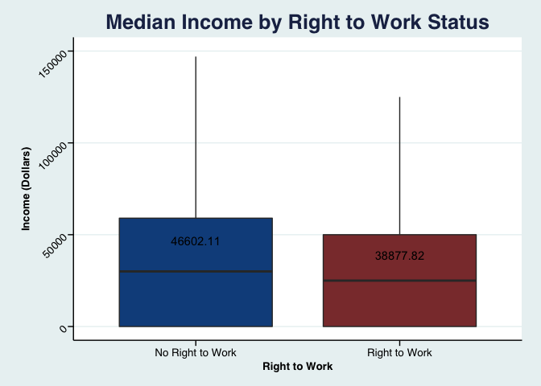
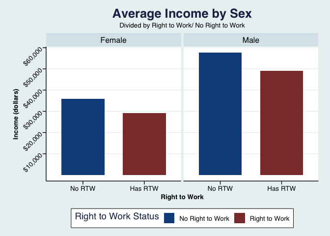
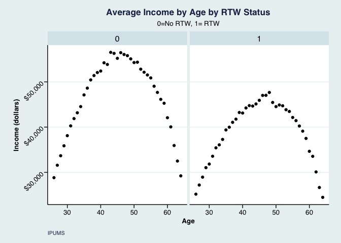

Income and Right to Work in the United States
================

Dataset
=======

###### We are drawing our data from a subsample of the American Community Survey (ACS) data from the year 2016. The ACS is a survey conducted annually by the U.S. Census Bureau, gathering long-form information previously collected in the Decennial (conducted in years ending 0) Census.

Policy Analysis
===============

###### Right to Work (RTW) refers to state laws that prohibit unions from compelling individuals to join, or pay union dues as condition for employment.. In addition, Right to Work laws often prohibit contracts that mandate only hiring a unionized workforce.

###### Although Right to Work laws may seem beneficial to some, critics argue that they are inherently “anti-union.” Due to the existence of federal laws that prevent mandatory union membership, and some argue that Right to Work laws harm unions’ bargaining strength, subsequently lowering salaries and benefits for vulnerable workers.

Purpose of Analysis
-------------------

###### Our analysis aims to contribute to this discussion of Right to Work. We aim to consider the relationship between Right to Work laws and outcomes for workforce in terms of income.

-   *H*0 = There is no significant difference in the means of income wages in states with RTW and without RTW.
-   *H*1 = There is a significant difference in the means of income wage in states with RTW and without RTW.

<!-- -->

    ## Warning: Removed 55471 rows containing non-finite values (stat_boxplot).

    ## 
    ## Call:
    ## lm(formula = incwage ~ Right_to_Work, data = dataset)
    ## 
    ## Residuals:
    ##    Min     1Q Median     3Q    Max 
    ## -46602 -38878 -13878  15122 697122 
    ## 
    ## Coefficients:
    ##                Estimate Std. Error t value Pr(>|t|)    
    ## (Intercept)    46602.11      68.28  682.50   <2e-16 ***
    ## Right_to_Work1 -7724.29      97.08  -79.57   <2e-16 ***
    ## ---
    ## Signif. codes:  0 '***' 0.001 '**' 0.01 '*' 0.05 '.' 0.1 ' ' 1
    ## 
    ## Residual standard error: 61530 on 1607065 degrees of freedom
    ## Multiple R-squared:  0.003924,   Adjusted R-squared:  0.003923 
    ## F-statistic:  6331 on 1 and 1607065 DF,  p-value: < 2.2e-16

    ## # A tibble: 4 x 3
    ## # Groups:   sex [?]
    ##   sex    Right_to_Work   mean
    ##   <chr>  <fct>          <dbl>
    ## 1 Female 0             35929.
    ## 2 Female 1             29113.
    ## 3 Male   0             57619.
    ## 4 Male   1             49021.

For Females in states with no RTW laws, the average income is **35929**, while females in states with RTW laws earn **29113**. For Males in states with no RTW laws, the average income is **57619**, while males in states with RTW earn **49021**. These results shows that the presence of RTW laws effect both male and female income earnings.

    ## 
    ##  Welch Two Sample t-test
    ## 
    ## data:  incwage by sex
    ## t = -215.56, df = 1331800, p-value < 2.2e-16
    ## alternative hypothesis: true difference in means is not equal to 0
    ## 95 percent confidence interval:
    ##  -21010.44 -20631.81
    ## sample estimates:
    ## mean in group Female   mean in group Male 
    ##             32551.29             53372.42

This t-test shows if there is a significant difference in the mean values of income between Males and Females. With a P-value of 2.2e-16, we can safely reject the null hypothesis that there is no difference in the mean values of income between Males and Females.

### Our results are **Significant**;

On average, all else equal, being an RTW State is associated with a decrease of USD 7736.112 in the wage income. Also, on average, all else equal, one more year in age is associated with an increase of approximately USD 71 in annual wages.

    ## 
    ## Call:
    ## lm(formula = as.numeric(incwage) ~ Right_to_Work + age, data = dataset)
    ## 
    ## Residuals:
    ##    Min     1Q Median     3Q    Max 
    ## -47896 -38596 -13763  14886 698328 
    ## 
    ## Coefficients:
    ##                 Estimate Std. Error t value Pr(>|t|)    
    ## (Intercept)    43346.178    207.205  209.19   <2e-16 ***
    ## Right_to_Work1 -7736.112     97.072  -79.69   <2e-16 ***
    ## age               71.094      4.272   16.64   <2e-16 ***
    ## ---
    ## Signif. codes:  0 '***' 0.001 '**' 0.01 '*' 0.05 '.' 0.1 ' ' 1
    ## 
    ## Residual standard error: 61520 on 1607064 degrees of freedom
    ## Multiple R-squared:  0.004096,   Adjusted R-squared:  0.004094 
    ## F-statistic:  3305 on 2 and 1607064 DF,  p-value: < 2.2e-16

Our adjusted R-squared for this regression is small...

    ## [1] 0.004094474

##### The p-value for the interaction between sex\*Right\_to\_Work is &lt;2e-16 (significant), which indicates that the relationships between Right to Work and income length depends on gender - if the individual is male or female.

    ## 
    ##  Welch Two Sample t-test
    ## 
    ## data:  incwage by Right_to_Work
    ## t = 79.719, df = 1567500, p-value < 2.2e-16
    ## alternative hypothesis: true difference in means is not equal to 0
    ## 95 percent confidence interval:
    ##  7534.384 7914.203
    ## sample estimates:
    ## mean in group 0 mean in group 1 
    ##        46602.11        38877.82

    ##                        Df    Sum Sq   Mean Sq  F value Pr(>F)    
    ## sex                     1 1.741e+14 1.741e+14 47348.11 <2e-16 ***
    ## Right_to_Work           1 2.377e+13 2.377e+13  6462.57 <2e-16 ***
    ## sex:Right_to_Work       1 3.190e+11 3.190e+11    86.74 <2e-16 ***
    ## Residuals         1607063 5.910e+15 3.677e+09                    
    ## ---
    ## Signif. codes:  0 '***' 0.001 '**' 0.01 '*' 0.05 '.' 0.1 ' ' 1

Conclusion
==========

We found that there is a strong correlation between Right to Work and no Right to Work regarding income. We found compelling evidence to suggest that further significance when we consider sex and age as other explanatory variables.
